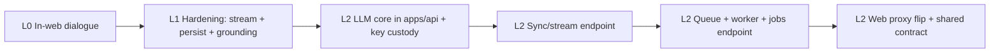

# Corduroy LLM — Build Plan (Staff Dialogue + LLM Gateway)

**Goal:** Deliver a working staff-facing LLM assistant ("Zophia"), then converge on a single LLM implementation that serves both **interactive dialogue** and **queued/background** work without duplicating provider integration.

**Reference:** [Build Plan](./buildplan.md), [TDD Platform](./tdd-platform.md). Related: [buildplan-vault.md](./buildplan-vault.md) (same BFF/proxy pattern), [railway-deploy.md](./railway-deploy.md) (LLM calls flagged as future orchestration work).

**Surfaces:** `apps/web` (Next.js, staff dashboard) · `apps/api` (Fastify orchestration API, `:4000`, `ORCHESTRATION_API_URL`).

---

## Status (2026-07-13)

**Shipped:** Preliminary end-to-end staff dialogue (L0) — the Zophia sidebar submits messages and renders live responses, calling **Anthropic** (phase-1 provider, client preference) directly from the Next.js server with a deterministic preview stub when no key is set.

| Layer | State |
|-------|--------|
| L0 — Preliminary in-web dialogue | **Shipped** |
| L1 — Web dialogue hardening (persistence, streaming, polish) | Not started |
| L2 — API LLM gateway (provider custody + queue + proxy) | Deferred (later phase) |

---

## Architecture decision — one gateway, two entry paths

**Problem:** Interactive chat and queued/batch LLM work have genuinely different runtime needs, but they should not become two separate provider integrations.

**Decision:** Build **one LLM core** (provider adapter, prompt assembly, model config, key custody, rate limiting, cost/audit) and expose it over **two transport surfaces**. Do not force latency-sensitive chat through a job queue; do not duplicate the OpenAI/Anthropic integration per surface.

| Workload | Path | Why |
|----------|------|-----|
| **Interactive staff dialogue** | Synchronous request/response (streaming later) — bypasses the queue | Low latency, user-in-the-loop |
| **Background / batch LLM** | Enqueue → worker drains → results written to Supabase | Durable, retryable, rate-limit-aware |

**Where it lands (target):** `apps/api` becomes the single LLM gateway. It already owns the `prompt_library` table and is the natural home for API-key custody, rate limiting, and cost/audit. `apps/web` calls it as a thin BFF proxy — exactly the pattern the Vault presign routes already use — so the browser (and eventually the Next.js server) never touches the provider key.

**Why not now:** `apps/api` today is a thin, synchronous, RLS-scoped Fastify service with **no queue/worker**, **no model SDK**, and **no service-role path**. Moving there means introducing a queue (`pg-boss` on the existing Postgres, or Supabase Queues), a privileged data path for grounded/background work, and streaming through Fastify. That is real work, so the preliminary dialogue ships in `apps/web` first and the gateway is deferred to **L2**.

---

## Data handling & security constraint — zero-retention by default

Client engagement data is sensitive, so every provider integration **must retain the option to run against zero-retention / zero-footprint API tiers**. This is a hard requirement on provider selection and configuration, not an afterthought.

**Requirements:**

- **Prefer zero-data-retention (ZDR) endpoints** — no server-side storage of prompts/completions, no human review, **no training on our data**. (e.g. Anthropic no-retention + no-training — the phase-1 provider — OpenAI ZDR / no-logging orgs, or self/VPC-hosted.)
- The **provider adapter must expose retention/training controls** (opt-out headers/flags, org/project selection) as first-class config — never hardcode a retention-on default.
- **Minimize what we send** — trim grounding context to what the task needs; prefer IDs/summaries over raw documents where possible.
- **BAA / DPA on file** with any provider before real client data flows through it; record the tier (ZDR vs standard) per environment.
- **Any conversation persistence we add is ours** (Supabase, our KMS), decoupled from provider-side retention — so we can offer memory without depending on the provider storing anything.
- **Auditability:** log which provider, model, and retention tier served each request (metadata only, not payloads).

This constraint threads into L1 (provider abstraction, persistence) and L2 (adapter config, key custody, audit) below.

---

## L0 — Preliminary in-web dialogue [DONE]

**Scope:** A working staff dialogue that runs entirely in `apps/web`. **Anthropic** (phase-1 provider) is called directly from the Next.js server route; the key lives in `apps/web/.env`. Falls back to a deterministic stub when unconfigured so the UI works with no provider.

Done   | # | Step | Note
-------|---|------|-------
[DONE] | 1 | Message/request/response types | `apps/web/src/lib/llm/staff-llm-dialogue-types.ts` |
[DONE] | 2 | Client fetch helper (`requestStaffLlmDialogue`, typed error, abort support) | `apps/web/src/lib/llm/staff-llm-dialogue-client.ts` |
[DONE] | 3 | Next.js route `POST /api/staff/llm/dialogue` — Supabase auth, history sanitize/cap, Zophia system prompt grounded on client name | `apps/web/src/app/api/staff/llm/dialogue/route.ts` |
[DONE] | 4 | Anthropic Messages API via `fetch` (no SDK dependency) | model from `ANTHROPIC_MODEL`, default `claude-3-5-sonnet-latest` |
[DONE] | 5 | Deterministic **preview stub** when `ANTHROPIC_API_KEY` unset | keeps dialogue working with no provider |
[DONE] | 6 | Sidebar wired — thread state, submit, auto-scroll, typing indicator, inline errors | `staff-llm-dialogue-sidebar.tsx` |
[DONE] | 7 | Composer — controlled textarea, Enter to send / Shift+Enter newline, disabled-while-sending | same file |
[DONE] | 8 | Styles — typing dots animation, error card, `pre-wrap` bubbles | `apps/web/src/app/globals.css` |
[DONE] | 9 | Env — `ANTHROPIC_API_KEY`, `ANTHROPIC_MODEL` (server-only, no `NEXT_PUBLIC_`) | `.env.example`, `apps/web/.env` |

**Known limits of L0:** no conversation persistence (in-memory per mount), no streaming (full-response only), key held by the web app, no rate limiting / cost accounting, no grounding beyond the selected client name.

---

## L1 — Web dialogue hardening [Next, optional]

**Scope:** Improve the in-web dialogue without yet moving to `apps/api`. Everything here is still compatible with an eventual L2 proxy flip.

Done   | # | Step | Note
-------|---|------|-------
[    ] | 1 | Provider abstraction in web (adapter interface) so L2 can lift it wholesale | prep for shared core; **retention/training controls as first-class config** |
[    ] | 2 | Response **streaming** (SSE / ReadableStream) token-by-token | UX; biggest perceived-latency win |
[    ] | 3 | Conversation **persistence** (Supabase table: thread + messages per staff/client) | **ours, not provider-side**; survive reloads, audit |
[    ] | 3a | Select + configure **zero-retention (ZDR) provider tier**; BAA/DPA on file | no training, no server-side storage |
[    ] | 4 | Grounding context — pull plan status, KPI deltas, open tasks, recent vault uploads into the system prompt | real "grounded" answers |
[    ] | 5 | Rate limiting / basic cost + token logging | guardrails before wider use |
[    ] | 6 | Toaster integration for errors (shared with vault polish item) | consistency |

---

## L2 — API LLM gateway [Deferred / later phase]

**Scope:** Converge on the single gateway in `apps/api`. This is the phase we are explicitly deferring.

Done   | # | Step | Note
-------|---|------|-------
[    ] | 1 | LLM core in `apps/api` — provider adapter(s), prompt assembly, model config | single implementation; **retention/training tier is explicit per-environment config** |
[    ] | 2 | **Key custody** moves to `apps/api` (`ANTHROPIC_API_KEY` off the web app) | browser/web server never hold the key; use ZDR org/project keys |
[    ] | 3 | `POST /staff/llm/dialogue` — synchronous + streaming endpoint (interactive path) | bypasses the queue |
[    ] | 4 | Queue + worker (`pg-boss` on existing Postgres, or Supabase Queues) | no new infra |
[    ] | 5 | `POST /staff/llm/jobs` — enqueue background/batch work; results written to Supabase | async path, same core |
[    ] | 6 | Privileged (service-role) data path for grounded/background work | `apps/api` is RLS-only today |
[    ] | 7 | Flip web dialogue route to a **thin BFF proxy** forwarding the staff JWT | mirrors `*-orchestration-api.ts` vault pattern |
[    ] | 8 | Extract `packages/llm-contract` for shared message/request types | stop hand-mirroring types |
[    ] | 9 | Rate limiting, cost accounting, audit centralized in the gateway | governance; **log provider/model/retention-tier per request (metadata only)** |

---

## Build order

| Track | Focus |
|-------|--------|
| **Done** | L0 preliminary in-web dialogue (submit + response + stub fallback) |
| **Next** | L1 hardening — streaming, persistence, grounding (optional, still web-side) |
| **Deferred** | L2 API LLM gateway — provider custody, queue/worker, proxy flip |

---

## Key env / ops reminders

| Surface | LLM-related config |
|---------|--------------------|
| Web (`apps/web/.env`) | `ANTHROPIC_API_KEY`, `ANTHROPIC_MODEL` — **server-only**, no `NEXT_PUBLIC_` (L0/L1) |
| API (`apps/api`) | Provider key + queue config **move here at L2**; browser/web never hold the key |
| Fallback | No `ANTHROPIC_API_KEY` → deterministic preview stub (dialogue still works) |
| Data handling | Use **zero-retention (ZDR) / no-training** provider tier for any real client data; BAA/DPA on file; record tier per environment |

Restart `next dev` after changing env vars so the new values load.
