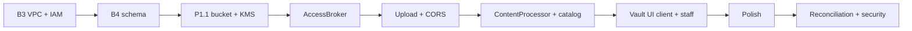

# Corduroy Vault — Build Plan (B3 + Phase 1)

**Goal:** Stand up the AWS data-plane skeleton (B3), then deliver per-client Vault storage, the two-Lambda retrieval service, and the Vault UI (Phase 1).

**Reference:** [Build Plan](./buildplan.md) (Milestone B3, Phase 1), [TDD Platform](./tdd-platform.md) §5 (Vault), §9 (environments), §12 (build sequence). Account credentials in [creds-platform.md](./creds-platform.md).

**Region:** `us-east-1` · **Account:** `789535501521` · **Seed client:** All-American Fitness (`9811e315-7f2d-4484-9929-709900bb1bbd`)

---

## Status (2026-07-06)

**Shipped:** End-to-end Vault file exchange for client and staff — upload, ingest, catalog, download — on dev AWS + production (`app.corduroytech.ai` / `staff.corduroytech.ai`).

| Layer | State |
|-------|--------|
| B3 infra (VPC, endpoints, IAM) | Applied in `dev` |
| B4 schema | Migrations written; applied to remote |
| P1.1 seed bucket + KMS | Live |
| AccessBroker + ContentProcessor Lambdas | Deployed |
| Client `/vault` UI | Live catalog + upload + download |
| Staff dashboard vault panel | Live catalog + upload + download |
| P1.5 reconciliation | Not started |
| P1.7 security checkpoint | Not started |
| UI polish | In progress (see P1.6.1) |

---

## Definition of done — B3 (AWS account skeleton)

- [DONE] Dedicated VPC with private subnets for future Lambda placement
- [DONE] S3 gateway endpoint and KMS interface endpoint attached to the VPC (TDD §5.1)
- [DONE] IAM execution-role stubs for AccessBroker and ContentProcessor
- [DONE] Terraform layout in `infra/` with `network`, `iam`, `kms`, `s3`, `vault-client`, `access-broker-lambda`, `content-processor-lambda`
- [DONE] Remote state backend (S3 + DynamoDB lock) configured; no secrets or state files in the repo
- [DONE] `terraform apply` succeeds in `dev`

> B3 originally scoped **no** per-client resources; seed client bucket/KMS were added in Phase 1.1 on the same stack.

---

## Definition of done — Phase 1 (The Vault)

- [DONE] Per-client S3 bucket + KMS key provisioned via IaC (seed client)
- [DONE] AccessBroker Lambda: pre-signed GET/PUT URLs, server-built keys, audit append
- [DONE] Upload flow: API → broker → browser PUT → S3 ObjectCreated trigger
- [DONE] ContentProcessor Lambda: type sniff, catalog upsert, ingest audit (derived/context deferred)
- [ ] Catalog reconciliation job
- [DONE] Vault UI — client add-source + repository; staff vault panel for selected client
- [ ] Security checkpoint: cross-client access review, canary health check, break-glass runbook

---

## Verification scripts

Run from repo root (API on `:4000`, Lambdas deployed):

| Script | What it exercises |
|--------|-------------------|
| `npm run test:vault-presign` | Client sign-in → presign upload URL |
| `npm run test:vault-upload` | Presign + browser-style PUT to S3 |
| `npm run test:vault-ingest` | Upload + poll `vault_objects` + `vault.ingest_raw` |
| `npm run test:vault-download` | Client presign GET + fetch bytes |
| `npm run test:vault-staff-download` | Staff presign GET for assigned client |
| `npm run test:supabase-service-key` | Service role can read `client_vault_storage` |

---

## B3 — AWS account skeleton (step-by-step)

**Scope:** VPC, endpoints, IAM stubs, and `infra/` scaffold. Per-client resources deferred to Phase 1 (now live for seed client).

### Phase 0 — Account & local tooling

Done   | # | Step | Note
-------|---|------|-------|
[DONE] | 1 | Dedicated Corduroy AWS account |  `789535501521` |
[    ] | 2 | MFA on root user |
[DONE] | 3 | IAM admin / programmatic access (local credentials only) | profile `corduroy` |
[DONE] | 4 | `aws sts get-caller-identity`; region `us-east-1` |
[DONE] | 5 | AWS CLI v2, Terraform ≥ 1.5 |
[DONE] | 6 | CloudTrail |
[DONE] | 7 | Billing alarm |

### Phase 1 — `infra/` repository layout

Done   | # | Step | Note
-------|---|------|-------|
[DONE] | 8 | `infra/` at repo root |
[DONE] | 9 | Terraform state backend (S3 + DynamoDB lock) | `corduroy-tfstate-789535501521` |
[DONE] | 10 | `infra/.gitignore` for state / tfvars |
[DONE] | 11 | Outputs documented in `infra/README.md` | 

### Phase 2 — VPC & networking

Done   | # | Step | Note
-------|---|------|-------|
[DONE] | 12 | `modules/network/` — VPC, private subnets |
[DONE] | 13 | Lambda security group |
[DONE] | 14 | Tagging convention |

### Phase 3 — VPC endpoints

Done   | # | Step | Note
-------|---|------|-------|
[DONE] | 15 | S3 gateway endpoint |
[DONE] | 16 | KMS interface endpoint |
[DONE] | 17 | Optional: logs, secretsmanager endpoints |
[DONE] | 18 | Verify endpoints after apply |

### Phase 4 — IAM role stubs

Done   | # | Step | Note
-------|---|------|-------|
[DONE] | 19 | Lambda execution roles + VPC access attachment | [DONE] |
[DONE] | 20 | `access-broker` + `content-processor` roles | [DONE] |
[DONE] | 21 | `railway-invoke` IAM user, scoped `lambda:InvokeFunction` | [DONE] |
| 22 | KMS never-delete guardrails documented | ☐ |

### Phase 5 — Modules

Done   | # | Step | Note
-------|---|------|-------|
[DONE] | 23 | `modules/kms/` |
[DONE] | 24 | `modules/s3/` |
[DONE] | 25 | `modules/access-broker-lambda/`, `content-processor-lambda/` | (replaces generic `lambda/` stub) |
[DONE] | 26 | Wired in `environments/dev/main.tf` | 

### Phase 6 — Apply & verify B3

Done   | # | Step | Note
-------|---|------|-------|
[DONE] | 27–29 | init / plan / apply |
[DONE] | 30 | Smoke checks (VPC, endpoints, role ARNs) |
[    ] | 31 | Update [buildplan.md](./buildplan.md) B3 section |

---

## Phase 1 — The Vault

Ordered per [TDD Platform](./tdd-platform.md) §12 and [buildplan.md](./buildplan.md).

### P1.0 — Schema prerequisite (B4)

- [DONE] `audit_events` — append-only (who, client, object, when, why)
- [DONE] `vault_objects` — catalog table (client_id, key, prefix, type, source, size, created_at)
- [DONE] `client_vault_storage` — bucket + KMS coordinates per client
- [DONE] Applied to remote Supabase

### P1.0.1 — Vault provisioning flow (design)

**Today (manual):**

1. Staff creates client in admin UI → `clients` row
2. Ops adds `client_id` to `infra/environments/dev/terraform.tfvars` → `terraform apply` (AWS bucket + KMS)
3. Upsert `client_vault_storage` row (`status = active`, bucket + KMS ARN)

**Target (later):** `provisionClientVault(clientId)` — API or CI job; staff UI “Provision Vault” button.

| Store | Role |
|-------|------|
| `terraform.tfvars` | Ops input: which clients to provision in AWS |
| `client_vault_storage` | **Runtime** lookup: bucket name, KMS ARN for AccessBroker |
| `vault_objects` | Catalog of files *inside* the bucket |

### P1.1 — Per-client storage (IaC)

- [DONE] `modules/kms` and `modules/s3` (via `vault-client`)
- [DONE] Bucket + KMS for seed client (All-American Fitness)
- [DONE] Prefix layout: `raw/`, `derived/`, `context/`, `audit/` (virtual)
- [DONE] Per-client cost tags
- [DONE] Bucket policy: Lambda execution roles only, scoped per client

### P1.2 — AccessBroker Lambda

- [DONE] `apps/access-broker` (validate, pre-sign, audit append)
- [DONE] Terraform `infra/modules/access-broker-lambda` (no VPC — Supabase HTTPS)
- [DONE] API `POST /client/vault/presign-upload`, `presign-download`
- [DONE] API `POST /staff/vault/presign-upload`, `presign-download` (assigned client)
- [DONE] Build + `terraform apply` with `supabase_service_role_key` in tfvars
- [DONE] Railway IAM keys + `ACCESS_BROKER_LAMBDA_NAME` on API (production)
- [DONE] Staff telltale: `GET /staff/vault/access-broker-status` (DryRun invoke)

### P1.3 — Upload flow

- [DONE] Client: Next.js proxy → API → AccessBroker → browser PUT to S3
- [DONE] Staff: same path with `client_id` + assignment check
- [DONE] S3 bucket CORS — **both** `app.*` and `staff.*` origins (local + production)
- [DONE] S3 ObjectCreated on `raw/` → ContentProcessor

### P1.4 — ContentProcessor Lambda

- [DONE] S3 event trigger on `raw/` ObjectCreated
- [DONE] HeadObject → content-type → `object_type` on catalog row
- [ ] Write derived artifacts to `derived/` and `context/` (deferred)
- [DONE] Upsert `vault_objects`; append `vault.ingest_raw` audit row
- [DONE] Supabase via env vars (PostgREST, same pattern as AccessBroker)
- [DONE] `npm run test:vault-ingest`

### P1.5 — Catalog reconciliation

- [ ] Scheduled + on-demand job: LIST bucket vs `vault_objects`, add missing rows, flag orphans
- [ ] Reconcile never rebuild — no wipe-and-regenerate (TDD §5.5)

### P1.6 — Vault UI

- [DONE] Client `/vault`: upload pane + live repository (grouped by source)
- [DONE] Client download on catalog rows
- [DONE] Staff dashboard: vault panel on selected client (upload + catalog + download)
- [DONE] Live catalog via Supabase RLS + `/api/client/vault/objects`, `/api/staff/vault/objects`

### P1.6.1 — UI polish (open)

Functional MVP shipped; polish pass in progress:
- [ ] Upon upload, extract filename and use as Source label (Source label override not required)
- [ ] Show progress indicator as small stripe under app-topbar-inner, whille waiting for functions to complete, show animation in stripe; hide when complete
- [ ] Catalog:Be sure name of file (from database) is shown in vault-source-row title
- [ ] Catalog: vault-source-icon should indicate the type of file (PDF, DOCx, etc.)
- [ ] Catalog: Download button in file listing should have an icon
- [ ] Catalog row title: show original filename where available (may need metadata column or key parsing)
- [ ] Build universal toaster interface for result messages of all types (slide-in div from upper right corner containing message/type (warning, danger, info, etc)
- [ ] Success message: friendly filename, not raw `s3_key` / audit UUID
- [ ] Catalog: Disable or clearly mark placeholder fields (category, date, integrations grid)
- [ ] Catalog: Empty / error states copy review (client + staff)
- [ ] Hover over vault-dropzone highlights div
- [ ] Remove all checkboxes for now

<<DEFERRED>>
- [ ] Source label **above** dropzone (or sensible default e.g. `manual-upload`) <<N/A: INFER FILE NAME DURING UPLOAD>>
- [ ] Staff console: vault panel layout pass (fits under engagement preview without scroll fatigue) <<leave this for now>>

### P1.7 — Security checkpoint

- [ ] Cross-client access review (no token/bucket/key leakage across clients)
- [ ] Canary: mint and use pre-signed URL end-to-end (partially covered by test scripts)
- [ ] Break-glass runbook: account owner reaches data without Lambda (TDD §5.7)
- [ ] KMS never-delete rule documented and enforced in IAM

---

## Build order

| Track | Focus |
|-------|--------|
| **Done** | B3/B4, P1.1–P1.4, P1.6 core (client + staff file exchange) |
| **Now** | P1.6.1 UI polish |
| **Next** | P1.5 reconciliation, P1.7 security checkpoint |
| **Deferred** | Derived/context extraction, automated vault provisioning |

---

## Key env / ops reminders

| Surface | Vault-related config |
|---------|---------------------|
| Railway API | `ACCESS_BROKER_LAMBDA_NAME`, AWS invoke creds, `SUPABASE_*`, `CORS_ORIGINS` (app + staff) |
| Vercel web | `ORCHESTRATION_API_URL`, `SUPABASE_*` |
| Terraform tfvars | `supabase_service_role_key`, `vault_clients` map |
| S3 CORS | Must include **both** client and staff browser origins |

See also: [railway-deploy.md](./railway-deploy.md), [apps/api/docs/lambda-ops.md](../apps/api/docs/lambda-ops.md).
