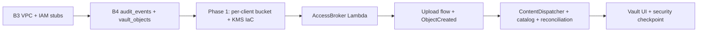

# Corduroy Vault — Build Plan (B3 + Phase 1)

**Goal:** Stand up the AWS data-plane skeleton (B3), then deliver per-client Vault storage, the two-Lambda retrieval service, and the Vault UI (Phase 1).

**Reference:** [Build Plan](./buildplan.md) (Milestone B3, Phase 1), [TDD Platform](./tdd-platform.md) §5 (Vault), §9 (environments), §12 (build sequence). Account credentials in [creds-platform.md](./creds-platform.md).

> **Region:** Pick one AWS region and use it everywhere (e.g. `us-east-1`). Corduroy has no region pinned in the repo yet — document the choice in `infra/README.md` when B3 lands.

---

## Definition of done — B3 (AWS account skeleton)

- [ ] Dedicated VPC with private subnets for future Lambda placement
- [ ] S3 gateway endpoint and KMS interface endpoint attached to the VPC (TDD §5.1)
- [ ] IAM execution-role stubs for AccessBroker and ContentDispatcher (no Lambdas deployed yet)
- [ ] Terraform layout in `infra/` with implemented `network` + `iam` modules and empty stubs for `kms`, `s3`, `lambda`
- [ ] Remote state backend (S3 + DynamoDB lock) configured; no secrets or state files in the repo
- [ ] `terraform apply` succeeds in a `dev` environment with **no** per-client buckets, KMS keys, or Lambda functions

---

## Definition of done — Phase 1 (The Vault)

- [ ] Per-client S3 bucket + KMS key provisioned via IaC (one seed client first)
- [ ] AccessBroker Lambda: pre-signed GET/PUT URLs, server-built keys, audit append
- [ ] Upload flow: API → broker → browser PUT → S3 ObjectCreated trigger
- [ ] ContentDispatcher Lambda: extract, derived writes, catalog upsert
- [ ] Catalog reconciliation job
- [ ] Vault UI (add-source + repository views)
- [ ] Security checkpoint: cross-client access review, canary health check, break-glass runbook

---

## B3 — AWS account skeleton (step-by-step)

**Scope:** VPC, endpoints, IAM stubs, and `infra/` scaffold only. **No per-client buckets, no Lambdas, no real Vault traffic.**

### Phase 0 — Account & local tooling (before Terraform)

| # | Step | Done? |
|---|------|-------|
| 1 | **Confirm AWS account** — dedicated Corduroy account (or a clearly named sub-account), not a personal sandbox mixed with other projects. | ☐ |
| 2 | **Enable MFA** on the root user; don't use root for day-to-day work. | ☐ |
| 3 | **Create an IAM admin user** (or use IAM Identity Center) for yourself with programmatic access. Store access key only in local `~/.aws/credentials` — never in the repo. | ☐ |
| 4 | **Verify credentials locally:** `aws sts get-caller-identity`; `aws configure get region` (set default region if empty). | ☐ |
| 5 | **Install tooling:** AWS CLI v2, Terraform ≥ 1.5 (or CDK if preferred — TDD allows either; pick one for `infra/`). | ☐ |
| 6 | **Enable CloudTrail** (organization trail or account trail) — audit who changes IAM/VPC/KMS later. | ☐ |
| 7 | **Set a billing alarm** (e.g. SNS → email at $50 / $100) so VPC endpoints and stray resources don't surprise you. | ☐ |

### Phase 1 — `infra/` repository layout

| # | Step | Done? |
|---|------|-------|
| 8 | **Create `infra/` at repo root** with this shape (see tree below). | ☐ |
| 9 | **Terraform state backend** — create once (manually or via a tiny `bootstrap/` stack): S3 bucket `corduroy-tfstate-<account-id>` (versioning on, encryption on, block public access); DynamoDB table `corduroy-tfstate-lock`. Wire `backend "s3"` in each environment. Do not commit state files. | ☐ |
| 10 | **Add `infra/.gitignore`:** `*.tfstate*`, `.terraform/`, `*.tfvars` (keep `*.tfvars.example`). | ☐ |
| 11 | **Document required outputs** in `infra/README.md`: `vpc_id`, `private_subnet_ids`, `lambda_execution_role_arn`, endpoint IDs. Railway/API will need these in Phase 1. | ☐ |

```
infra/
├── README.md                 # how to init/apply, region, state backend
├── environments/
│   ├── dev/                  # or staging — start with one env
│   │   ├── main.tf
│   │   ├── variables.tf
│   │   ├── outputs.tf
│   │   └── terraform.tfvars.example
│   └── prod/                 # same modules, different tfvars (can stub empty for now)
├── modules/
│   ├── network/              # VPC, subnets, endpoints  ← B3 implements this
│   ├── iam/                  # Lambda execution role stubs
│   ├── kms/                  # empty stub (Phase 1)
│   ├── s3/                   # empty stub (Phase 1)
│   └── lambda/               # empty stub (Phase 1)
└── backend.tf.example        # S3 + DynamoDB lock (see step 9)
```

### Phase 2 — VPC & networking (TDD §5.1, §9)

| # | Step | Done? |
|---|------|-------|
| 12 | **`modules/network/` — VPC:** CIDR e.g. `10.0.0.0/16`; 2–3 **private subnets** across AZs (Lambda will run here). Optional small public subnets only if NAT is needed later; for B3, Lambdas in private subnets + VPC endpoints often avoid NAT cost. | ☐ |
| 13 | **Security groups (minimal for B3):** `lambda-default` — egress all (or restrict to VPC CIDR + endpoints). No ingress rules needed for Lambdas invoked by AWS. | ☐ |
| 14 | **Tagging convention** from day one (TDD §9): `Project=corduroy`, `Environment=dev\|prod`, `ManagedBy=terraform`. | ☐ |

### Phase 3 — VPC endpoints (TDD §5.1)

These keep Lambda ↔ S3/KMS traffic on the AWS network.

| # | Step | Done? |
|---|------|-------|
| 15 | **S3 gateway endpoint** — attach to private route tables (no hourly charge). | ☐ |
| 16 | **KMS interface endpoint** — private subnets + security group allowing HTTPS from Lambda SG. | ☐ |
| 17 | **(Optional but useful for Phase 1)** Interface endpoints for `logs` (CloudWatch), `secretsmanager` (ContentDispatcher Supabase cred), `lambda` (if invoking from inside VPC later). | ☐ |
| 18 | **Verify endpoints** after apply: `aws ec2 describe-vpc-endpoints --filters Name=vpc-id,Values=<vpc_id>`. | ☐ |

### Phase 4 — IAM role stubs (no Lambdas yet)

| # | Step | Done? |
|---|------|-------|
| 19 | **`modules/iam/` — `vault-lambda-execution` role:** trust policy `lambda.amazonaws.com`; attach `AWSLambdaVPCAccessExecutionRole`. Do **not** attach broad S3/KMS policies yet — Phase 1 scopes per-client. | ☐ |
| 20 | **Stub two role names** (or same module, two roles): `access-broker` execution role; `content-processor` execution role. Empty/minimal policies for B3; real bucket ARNs come in Phase 1. | ☐ |
| 21 | **`railway-invoke` IAM user or role (stub only):** policy `lambda:InvokeFunction` on specific function ARNs — **no S3, no KMS** (TDD §5.3). Attach placeholder/deny-all until functions exist. | ☐ |
| 22 | **KMS key admin guardrails (policy stub, no keys yet):** document that per-client keys are **never delete**; only a break-glass principal can schedule deletion (TDD §5.7). | ☐ |

### Phase 5 — Empty modules (placeholders only)

| # | Step | Done? |
|---|------|-------|
| 23 | **`modules/kms/`** — `variables.tf` + `outputs.tf` + README: per-client key in Phase 1. | ☐ |
| 24 | **`modules/s3/`** — same: bucket naming `corduroy-vault-<client_id>`, prefixes `raw/`, `derived/`, `context/`, `audit/`. | ☐ |
| 25 | **`modules/lambda/`** — same: AccessBroker + ContentDispatcher placeholders. | ☐ |
| 26 | **Wire modules in `environments/dev/main.tf`** — call `network` + `iam` only; comment out or no-op `kms` / `s3` / `lambda`. | ☐ |

### Phase 6 — Apply & verify B3

| # | Step | Done? |
|---|------|-------|
| 27 | `cd infra/environments/dev && terraform init && terraform plan` | ☐ |
| 28 | Review plan: **only** VPC, subnets, endpoints, IAM roles — no S3 buckets, no Lambdas, no KMS keys. | ☐ |
| 29 | `terraform apply` | ☐ |
| 30 | **Smoke checks:** VPC + subnets exist in console; S3 + KMS endpoints `available`; Lambda execution role ARN in outputs; output pattern documented (not secret values in repo). | ☐ |
| 31 | **Update [buildplan.md](./buildplan.md)** — check off B3 items when done. | ☐ |

### Explicit B3 boundary — do not do yet

| Defer to | Item |
|----------|------|
| **B4** | `audit_events` + `vault_objects` Supabase migrations |
| **Phase 1 §5** | Per-client S3 bucket + KMS key provisioning |
| **Phase 1 §6–8** | AccessBroker / ContentDispatcher Lambda code + deploy |
| **Phase 1 §7** | S3 ObjectCreated triggers, upload flow |
| **Railway** | `AWS_ACCESS_KEY_ID` with invoke-only scope (after Lambdas exist) |

---

## Phase 1 — The Vault (after B3)

Ordered per [TDD Platform](./tdd-platform.md) §12 items 5–11 and [buildplan.md](./buildplan.md).

### P1.0 — Schema prerequisite (B4, can run parallel to B3)

- [DONE] `audit_events` — append-only (who, client, object, when, why)
- [DONE] `vault_objects` — catalog table (client_id, key, prefix, type, source, size, created_at)
- [DONE] `client_vault_storage` — bucket + KMS coordinates per client (`20260706150000_client_vault_storage.sql`)
- [ ] Apply latest migrations to remote

### P1.0.1 — Vault provisioning flow (design)

**Today (manual):**

1. Staff creates client in admin UI → `clients` row
2. Ops adds `client_id` to `infra/environments/dev/terraform.tfvars` → `terraform apply` (AWS bucket + KMS)
3. Insert/upsert `client_vault_storage` row (`status = active`, bucket + KMS ARN) — migration backfill or SQL

**Target (Phase 1.2+):** `provisionClientVault(clientId)` — API or Lambda that runs Terraform/CI or calls AWS SDK, then upserts `client_vault_storage` via service role. Staff UI button: “Provision Vault”.

| Store | Role |
|-------|------|
| `terraform.tfvars` | Ops input: which clients to provision in AWS |
| `client_vault_storage` | **Runtime** lookup: bucket name, KMS ARN for AccessBroker |
| `vault_objects` | Catalog of files *inside* the bucket |

v1 TDD: one **primary** bucket per client (`purpose = 'primary'`). Table allows `archive` / `migration` buckets later without schema churn.

### P1.1 — Per-client storage (IaC)

- [ ] Flesh out `modules/kms` and `modules/s3`
- [ ] Provision bucket + KMS key for seed client (All-American Fitness)
- [ ] Prefix layout: `raw/`, `derived/`, `context/`, `audit/` (TDD §7.2)
- [ ] Per-client cost tags from day one (TDD §9)
- [ ] Bucket policy: access only via Lambda execution roles, scoped per client

### P1.2 — AccessBroker Lambda

- [DONE] Implement in `apps/access-broker` (validate, pre-sign, audit append)
- [DONE] Terraform module `infra/modules/access-broker-lambda` (no VPC — needs Supabase HTTPS; private subnets have no NAT)
- [DONE] API routes `POST /client/vault/presign-upload` and `presign-download`
- [ ] Build + `terraform apply` with `supabase_service_role_key` in tfvars
- [ ] Create Railway IAM access keys (`corduroy-dev-railway-invoke`) + env on API
- [ ] Scope Railway credential to `lambda:InvokeFunction` only (auto when Lambda deploys)

### P1.3 — Upload flow

- [DONE] API route: client requests upload → invoke AccessBroker → return PUT URL
- [DONE] Browser PUTs directly to S3 (client `/vault` upload + `npm run test:vault-upload`)
- [DONE] S3 bucket CORS for browser PUT (Terraform `modules/s3`)
- [DONE] S3 ObjectCreated on `raw/` triggers ContentProcessor (P1.4)

### P1.4 — ContentProcessor Lambda

- [DONE] S3 event trigger on `raw/` ObjectCreated (`modules/s3` + `content-processor-lambda`)
- [DONE] Type sniff via HeadObject content-type → `object_type` on catalog row
- [ ] Write derived artifacts to `derived/` and `context/` (deferred)
- [DONE] Upsert `vault_objects`; append `vault.ingest_raw` audit row (append-only)
- [DONE] Supabase via env vars on Lambda (same PostgREST pattern as AccessBroker)
- [DONE] Build + `terraform apply`; verify with `npm run test:vault-ingest`

### P1.5 — Catalog reconciliation

- [ ] Scheduled + on-demand job: LIST bucket vs `vault_objects`, add missing rows, flag orphans
- [ ] Reconcile never rebuild — no wipe-and-regenerate (TDD §5.5)

### P1.6 — Vault UI

- [DONE] Client `/vault`: add-source pane (upload + metadata) and data repository (catalog grouped by source)
- [DONE] Client download: presign GET + browser fetch (`/api/client/vault/presign-download`, catalog Download button)
- [ ] Staff: upload/download for selected client via same broker path
- [DONE] Wire to live catalog (`vault_objects` via Supabase RLS + `/api/client/vault/objects`)

### P1.7 — Security checkpoint

- [ ] Cross-client access review (no token/bucket/key leakage across clients)
- [ ] Canary: mint and use pre-signed URL against canary object end-to-end
- [ ] Break-glass runbook: account owner reaches data without Lambda (TDD §5.7)
- [ ] KMS never-delete rule documented and enforced in IAM

---

## Build order



| Track | Focus |
|-------|--------|
| **Today (B3)** | Account hygiene → `infra/` scaffold → VPC + endpoints → IAM stubs → plan/apply/verify |
| **Parallel** | B4 Supabase migrations |
| **Next** | Phase 1.1 — first real bucket for seed client |

---

## Suggested first session (B3 only)

1. Steps 1–7 — account hygiene + `aws sts get-caller-identity`
2. Steps 8–11 — `infra/` scaffold + state backend
3. Steps 12–18 — VPC + endpoints
4. Steps 19–22 — IAM stubs
5. Steps 27–30 — plan / apply / verify

That yields a mergeable `infra/` PR with no Vault data plane — exactly what B3 requires before Phase 1 work begins.
