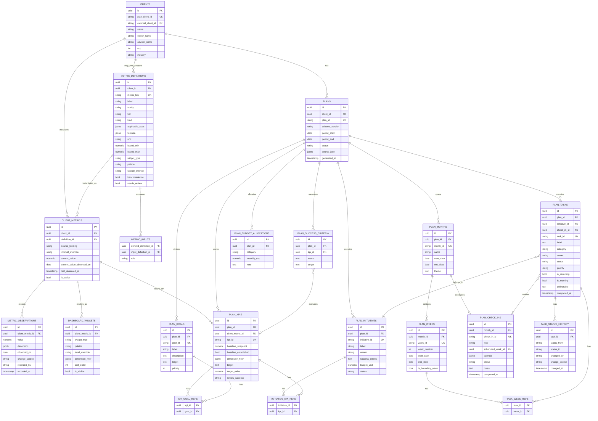

# Corduroy Platform — 90-Day Plan & Metric Library Schema

**Version:** 2.0
**Supersedes:** `90day_plan_schema_guide.md` v1.0
**Last updated:** July 2026
**Owner:** Corduroy Technologies — Platform Engineering

---

## What changed from v1.0

Version 1.0 treated the 90-Day Plan's KPIs as self-contained: each plan owned its own metric definitions, its own current values, and its own history. That model works for one client and breaks at five, because nothing is comparable across plans and every plan regenerates definitions the platform already knows.

Version 2.0 introduces a **metric library** — a catalog of standardized SMB metric definitions — and rebinds the plan's KPIs to it. The plan no longer owns metric values. It owns *targets against* metric values.

Three concrete changes:

| v1.0 | v2.0 |
|---|---|
| `plan_kpis` held `current_value`, `source`, `frequency` | `plan_kpis` is a binding: metric + baseline + target + goal |
| `kpi_history` held plan-scoped observations | `metric_observations` holds all observations, plan-independent |
| Metric definitions were invented per-plan by the LLM | `metric_definitions` is a curated catalog; the LLM *selects* from it |

The plan tables are otherwise unchanged. If you read v1.0, the sections on tasks, weeks, check-ins, and status history still apply verbatim.

---

## Governing principles

**Generate once, update forever.**
The plan JSON is a generation and transport format, never the live record. Once ingested, no process writes back into it. New JSON is produced only at milestone boundaries, as an export.

**Definitions are global; observations are client-scoped.**
A metric like `revenue` is defined exactly once for the entire platform. Every client instantiates it. This is what makes cross-client benchmarking possible, and it is the whole reason the library exists.

**Write-once baselines, mutable current values.**
Any stateful element carries a write-once baseline set at ingest and a mutable current value. Losing the baseline makes progress unmeasurable — and backdated observations arriving later must not silently rewrite what a client is being measured against.

**Append-only history, never in-place mutation.**
Observations and status changes append rows. Nothing is overwritten. This gives the advisor a complete audit trail and lets the coaching layer reason about velocity.

**Dual identifiers on every entity.**
Internal `uuid` primary keys for foreign keys; external string identifiers (`task_id`, `metric_key`) carried from the JSON. This decoupling lets a plan round-trip — generate, ingest, export, regenerate — without identifier collisions across clients.

**One observations table, not one per metric.**
`metric_observations` is polymorphic: a `numeric` value column plus a definition reference. The alternative — a typed table per metric — was considered and rejected. See *Considered and rejected* under that table.

**No cross-client access at any layer.**
Every client-scoped table reaches `clients` directly or through `plans`. Row-level security keys off `client_id`. No principal, human or agent, holds a credential spanning clients.

---

## Entity relationship diagram

---

## The two layers

The schema divides cleanly along a line worth naming, because the two halves have different lifecycles and different consumers.

**The metric layer** — `metric_definitions`, `client_metrics`, `metric_observations`, `dashboard_widgets` — is the always-on business health panel. It exists whether or not a plan is running. It survives plan completion. It is the only part of the schema that is benchmarkable across clients. Its lifespan is the client relationship.

**The plan layer** — everything prefixed `plan_` — is the scoreboard for one 90-day cycle. It is narrow, situational, and disposable. Its KPIs exist to answer whether four specific initiatives are working, not whether the business is healthy. Its lifespan is ninety days.

`plan_kpis` is the seam. It is the only table that touches both.

---

## Metric layer reference

### `metric_definitions`

**Purpose:** The catalog. One row per metric, defining what it is, how it renders, how often it should update, and whether it can be compared across clients.

**The nullable `client_id` is the central design decision.** When null, the row is a **library metric** — global, shared by every client, benchmarkable. When populated, the row is **bespoke** to that client. This single column lets one table hold both `revenue` (universal) and `mhs_paid_conversion` (exists for exactly one gym) without a second schema or a polymorphic union.

| Column | Notes |
|---|---|
| `client_id` | **Null = library metric.** Populated = bespoke to that client. |
| `metric_key` | Stable machine identifier (`revenue`, `gross_margin_pct`). What the plan generator selects by. Unique per `client_id` scope. |
| `label` | Human-readable display name. |
| `family` | Grouping for slot-based dashboards: `profitability`, `liquidity`, `retention`, `acquisition`, `productivity`. See *Retention is a family* below. |
| `tier` | `core` / `swap` / `bespoke`. Drives client provisioning. |
| `kind` | `observed` / `derived`. Determines whether a sync job fetches it or a computation produces it. |
| `applicable_ccps` | `jsonb` array of CCP integers. Empty or null on `core` rows. Populated on `swap` rows. |
| `formula` | `jsonb`. Present only when `kind = 'derived'`. Declares the computation. |
| `unit` | `currency` / `percent` / `count` / `days` / `ratio` / `months`. Drives formatting and validation. |
| `bound_min` / `bound_max` | Validation bounds. A churn rate is `[0, 1]`. Headcount is `[0, ∞)`. |
| `widget_type` / `palette` | The presentation contract. Defaults for `dashboard_widgets`, overridable per client. |
| `update_interval` | Expected data freshness. Drives staleness flagging. **Not** the review cadence — see below. |
| `benchmarkable` | True only when `client_id IS NULL`. Redundant but explicit; the benchmarking job filters on it. |
| `needs_review` | Set true on auto-minted bespoke definitions. Populates the advisor's review queue. |

**Seeding the catalog.** Provisioning a new client inserts one `client_metrics` row for every definition where `tier = 'core'`, plus every definition where `tier = 'swap'` and the client's CCP appears in `applicable_ccps`.

**The core is ten inputs and six ratios, not sixteen equals.** This is easy to miss. Runway is cash ÷ burn. DSO is AR ÷ revenue × days. Gross margin % is gross profit ÷ revenue. Revenue per employee is revenue ÷ headcount. CAC is marketing spend ÷ net new customers. None of these are values an accounting API hands you. If `kind` is not enforced from day one, the connector work will attempt to fetch "gross margin %" from QuickBooks and get nothing. Note also that **COGS must be an observed metric** even though it is absent from most SMB KPI lists — margin cannot be computed without it. (It is derivable as revenue − gross profit, but leaving that implicit is how sync jobs go wrong.)

**Retention is a family, not a swap slot.** It is correctly excluded from the core: churn is a headline metric for a gym and close to meaningless for a concrete supplier. But it is also not one metric with variants — a single client can carry two simultaneously. All-American Fitness has PIF renewal rate (member retention) *and* B2B contract renewal (logo retention). They are computed differently, sourced differently, and mean different things. The `family` column lets the dashboard occupy one slot labeled "Retention" while the underlying definition varies by CCP *and* by segment within a client.

**Promotion path.** A bespoke definition may generalize. `mhs_paid_conversion` is really *channel conversion rate*, which applies to any client with a named lead source. Promotion copies the row with `client_id = NULL`, then repoints affected `client_metrics.definition_id`. **Historical observations follow the `client_metrics` row, not the definition**, so they survive the repoint intact. This is the main reason `metric_observations` references `client_metrics` rather than referencing `metric_definitions` directly.

---

### `metric_inputs`

**Purpose:** Declares which metrics feed a derived metric.

**Why it exists:** So the platform can answer *"can we compute CAC for this client?"* before attempting to. If a client tracks marketing spend but not net new customers, CAC is uncomputable, and the dashboard should say so rather than render a wrong number.

| Column | Notes |
|---|---|
| `derived_definition_id` | FK to the derived metric. |
| `input_definition_id` | FK to an input metric. |
| `role` | Names the input's position in the formula (`numerator`, `denominator`, `period_days`). |

**Marketing CPL is not CAC.** CPL is spend ÷ leads. CAC is spend ÷ *acquired customers*. They differ by the full-funnel conversion rate. All-American Fitness happens to track lead→visit and visit→member, so CAC is derivable for them — but that is a coincidence of their plan, not a property of the library. Declaring inputs explicitly is what surfaces the difference.

---

### `client_metrics`

**Purpose:** One row per *(client, metric)* pair. The client's instantiation of a catalog definition. Roughly 12–15 rows per client.

**This table holds no history.** It is a configuration row plus a cache. The configuration is the source binding and interval override; the cache is `current_value`. Observations live one table down.

| Column | Notes |
|---|---|
| `source_binding` | Where this client's value comes from. Human-readable at launch (`"Lead Log — Google Sheet"`). Becomes a FK to a connector registry in Phase 2. |
| `interval_override` | Overrides `metric_definitions.update_interval` when a client's cadence genuinely differs. Usually null. |
| `current_value` | Cache of the most recent observation. Recomputed on every insert into `metric_observations`. |
| `current_value_observed_on` | The observation date of that cached value — not the write timestamp. These differ during backfill. |
| `last_observed_at` | Write timestamp of the most recent observation. Staleness is `now() - last_observed_at > effective_interval`. |
| `is_active` | Soft delete. A client who stops tracking a metric deactivates the row; observations are retained. |

**Why `current_value` is cached rather than computed on read:** the dashboard sorts and filters on it. At SMB scale the subquery would be fine, but the widget renderer benefits from a flat read, and the cache is trivially maintained by a trigger on `metric_observations`.

---

### `metric_observations`

**Purpose:** The single time series. One row per *(client, metric, observation date, dimension)*. Append-only.

**This is the table the user's intuition was pointing at.** A number, a client, a datestamp, a source. What it is *not* is one such table per metric.

| Column | Notes |
|---|---|
| `value` | `numeric`. Validated at write time against `bound_min` / `bound_max` on the definition. |
| `dimension` | `jsonb`. Optional segmentation — `{"segment": "b2b"}`, `{"channel": "mhs"}`. See below. |
| `observed_on` | The date the value describes. **Not** the write timestamp. |
| `change_source` | `connector_sync` / `manual_advisor` / `manual_client` / `agent_ingest` / `reconciliation`. |
| `recorded_by` | User or system identifier. |
| `recorded_at` | Server write timestamp. |

**Source priority.** When two observations share a `client_metric_id`, `observed_on`, and `dimension` but arrive from different sources, precedence is `connector_sync` > `manual_advisor` > `agent_ingest` > `manual_client`. Both rows are retained; the higher-priority one becomes `current_value`. This handles the common case where a client self-reports revenue and QuickBooks later contradicts it.

**Dimensions prevent catalog inflation.** All-American Fitness's plan lists "B2B Revenue" and "Active B2B Contracts" as separate KPIs. They are not separate metrics — they are `revenue` and `active_customers` with a segment filter. Without a dimension key, the plan generator mints a new definition every time a client wants to slice an existing metric, and within five clients you have `B2B Revenue`, `MHS Revenue`, `Wholesale Revenue` as distinct definitions that benchmark against nothing. The catalog must converge, and dimensions are what let it.

**Considered and rejected: one typed table per metric.** A `revenue` table with a client column, a value column, and a datestamp — repeated sixteen times — is a legitimate design. It gives type safety, per-metric `CHECK` constraints, and clean indexes. It was rejected for four reasons:

1. *Widgets could not be generic.* The locked-in dashboard model renders from validated jsonb rows against a fixed presentation contract. That requires fetching a series without knowing which metric it is. With per-metric tables the table name becomes data, forcing dynamic SQL or codegen.
2. *Every new metric becomes a migration.* Given the swap-slot model — where the metric set varies by CCP *by design* — schema migrations would ship as a routine part of client onboarding.
3. *Bespoke metrics have nowhere to live.* We are not creating an `mhs_paid_conversion` table for one gym.
4. *Cross-metric queries fragment.* "Show me every stale metric for this client" is one indexed query, or it is a sixteen-way `UNION ALL` regenerated whenever the catalog changes.

**What that costs us, stated plainly:** Postgres no longer enforces metric-specific rules. `value` is `numeric`; nothing at the database level prevents a churn rate of 4.7. That enforcement moves to a validation layer at write time, keyed off `unit` and the bounds columns on the definition. This is acceptable here because the write path is narrow — observations arrive from the ContentDispatcher, the advisor console, and the reconciliation job, and nowhere else. It would be unacceptable in a system where twenty services wrote directly.

**Scale sanity check.** 100 clients × 15 metrics × weekly observations × 3 years ≈ 234,000 rows. The performance argument for narrow typed tables does not bite for several orders of magnitude. **If a specific query does become painful**, the escape hatch is a materialized view per hot metric (`mv_revenue`), which recovers the typed surface without giving up the polymorphic write path. Watch `dimension` before watching row count — jsonb filtering degrades first. If segmented series become common, promote the one or two hot dimension keys to indexed columns.

---

### `dashboard_widgets`

**Purpose:** The presentation layer. One row per rendered widget.

**It points at `client_metrics`, not at `plan_kpis`.** This is the important repoint from v1.0. The KPI dashboard must keep rendering after a plan completes, and it must render metrics that were never part of any plan.

| Column | Notes |
|---|---|
| `widget_type` | `trend_line` / `bar` / `progress_to_goal` / `traffic_light` / `single_stat`. |
| `palette` | Inherits from the definition; overridable per client. |
| `label_override` | Rare. Lets a client see "Members" where the catalog says "Active Customers". |
| `dimension_filter` | `jsonb`. Renders a segmented series — `{"segment": "b2b"}` produces the B2B revenue widget. |
| `sort_order` | Display sequence. |
| `is_visible` | Advisors curate what the client sees without deleting configuration. |

**Progress-to-goal widgets need a plan.** When `widget_type = 'progress_to_goal'`, the renderer joins through `plan_kpis` on the active plan to find the target. If no active plan binds this metric, the widget degrades to `single_stat` rather than erroring.

---

## The seam

### `plan_kpis`

**Purpose:** Binds a client's metric to a plan's goal, with a baseline and a target. This is the entire table.

**It owns no values and no history.** In v1.0 it carried `current_value`, `source`, and `frequency`. All three moved: values to `metric_observations`, source to `client_metrics.source_binding`, and `frequency` split in two (see below).

| Column | Notes |
|---|---|
| `client_metric_id` | FK. Which metric this KPI scores. |
| `baseline_snapshot` | **Write-once.** The metric's value at plan generation. |
| `baseline_established` | False when the client had no tracking in place at plan start. See below. |
| `dimension_filter` | `jsonb`. Scopes the KPI to a segment — this is how "B2B Revenue" is expressed. |
| `target` | Free text, for the human. |
| `target_value` | Numeric, for the progress bar. Nullable — some targets are qualitative. |
| `review_cadence` | How often this is *discussed*. Distinct from update interval. |

**Why `baseline_snapshot` is stored rather than derived.** It could be computed as the observation nearest `plans.period_start`. It is not, because backdated observations arriving mid-plan would silently rewrite the number the client is measured against. A client uploading six months of historical QuickBooks data in week four must not change what week one looked like. Write-once, captured at ingest.

**Null baselines are a finding, not a defect.** Nine of All-American Fitness's thirteen KPIs have no baseline because the business tracked nothing. Do not backfill zeros — that misrepresents progress as growth from nothing. Set `baseline_established = false` and render "Baseline not yet established." The first recorded observation becomes the de facto baseline, flagged as such.

**This problem self-heals, and that argues for building the library early.** A client onboarded in Q3 has two quarters of `revenue` observations by Q1. Their Q1 plan generates with real baselines automatically, because the metric layer outlived the Q3 plan. The catalog compounds. The benefit accrues only if the library exists *before* the second plan cycle.

**Cadence is two properties, not one.** v1.0 had a single `frequency` column. It conflated:

- `metric_definitions.update_interval` — *how fresh should this data be.* Drives staleness flags and the coaching layer's "your cash number is twelve days old" nudge.
- `plan_kpis.review_cadence` — *how often do we discuss this.* Drives the Monday review agenda and the month-end deck.

All-American Fitness's marketing CPL could update weekly while being reviewed monthly. Collapsing these means either noisy reviews or stale alerts.

---

## Plan layer reference

Unchanged from v1.0 unless noted. Abbreviated here; consult v1.0 for full rationale on the plan tables.

### `clients`
The client registry. One row per SMB. Persists across plans. **New in v2.0:** the `ccp` column, which drives swap-slot provisioning of `client_metrics`.

### `plans`
One row per 90-day cycle. Root of every plan-scoped query and the join point for RLS. `source_json` holds the complete, unmodified generated JSON as an immutable milestone artifact — written once at insert, never updated. A new cycle creates a *new* row; the prior is set to `archived` and retained indefinitely.

### `plan_goals`
The three-to-five top-level business objectives. Top of the traceability chain: `task → initiative → goal`. `target` is deliberately free text — goal targets are qualitative as often as numeric. The numeric version lives on the bound KPI.

### `plan_initiatives`
The strategic buckets grouping tasks. The unit at which a client thinks about the plan ("how's the B2B push going?"). `status` is a cached derivation from child task statuses, recomputed on any child change — it exists so the dashboard can sort without a subquery.

### `plan_months`
Three monthly containers, each carrying a theme and a month-end check-in. The natural boundary for milestone JSON export and formal advisor review.

### `plan_weeks`
Fifteen calendar weeks, Sunday to Saturday.

**The straddling-week decision.** Calendar weeks do not respect month boundaries — July 26 to August 1 belongs to both. Two options were considered: duplicate the week row under each month, or promote weeks to a direct child of `plans` with a nullable `month_id`. **Decision: duplicate, and flag with `is_boundary_week`.** The dashboard's primary view is monthly, and a duplicated row makes that render trivial. The cost — a task appearing in two grids — reads as correct to the client, because the task genuinely does span that week. Revisit after the first client sees the grid.

### `plan_check_ins`
The scheduled client-advisor meetings. Not tasks: they have agendas, participants, outcomes, and notes. `type` is `month_end_review` / `milestone_review` / `ad_hoc`; ad-hoc check-ins are created by advisor escalation, not by the generator. A check-in past its week with a null `completed_at` is an escalation trigger.

Check-ins also appear as rows in `plan_tasks` so they render in the calendar grid. The task carries `check_in_id` as a nullable FK. Deliberate denormalization — the alternative was a polymorphic union in the grid query.

### `plan_tasks`
The atomic unit of work. Fifty-seven rows for the AAF plan. The primary interactive element of the client dashboard; `status` is the toggle.

`initiative_id` is nullable (check-in tasks belong to no initiative). `check_in_id` is nullable (set only on meeting tasks). `is_meeting` is distinct from `check_in_id` because some meetings — the GloFox support call — are not formal check-ins.

**On recurring tasks.** A task with `is_recurring = true` and four week refs is one row, not four. The dashboard fans it out on render. Per-week completion is tracked in `task_status_history` rather than on the task row; `status` reflects the *current* week. This was the most contested decision in the schema. Materializing one row per occurrence makes completion trivially simple but bloats the table and breaks the one-task-one-identity model the generator produces.

### `task_week_refs`
Junction table mapping tasks to the weeks they are scheduled in. A task can span multiple weeks — "distribute MHS cards at every session" runs weeks 2 through 5. A single FK would force duplicate task rows.

**This is the table the calendar grid queries.** `plan_weeks ⋈ task_week_refs ⋈ plan_tasks` produces exactly the checkmark matrix in the printed plan.

### `task_status_history`
Append-only log of every status transition. Three consumers: the advisor console ("what did the client touch this week?"), the coaching layer ("this task has been in progress eighteen days — flag it"), and the audit trail. For recurring tasks, this table carries the per-week completion state.

### `kpi_goal_refs`, `initiative_kpi_refs`
Junction tables. Both relationships are genuinely many-to-many. "New Members Signed" serves membership growth. "Marketing CPL" serves marketing accountability. "MHS Leads Generated" serves both. A single FK would force an arbitrary choice.

### `plan_budget_allocations`
The monthly marketing budget by category. Deliberately flat — no hierarchy, five rows. Actual spend, when tracked, goes in a sibling table rather than mutating these rows. `note` carries the decision rule ("if CPL exceeds $50 with no conversions, reallocate") and renders as a tooltip.

### `plan_success_criteria`
The 90-day scorecard. Distinct from `plan_kpis` because a success criterion is *a statement about a metric at a point in time*, not the metric itself. `kpi_id` is nullable — "GloFox decision made" has no metric and is assessed by the advisor at the milestone review.

---

## Ingest pipeline

**Prerequisite: the catalog must be seeded.** Ingest binds plan KPIs to `metric_definitions`. Against an empty catalog every KPI falls through to bespoke, and the library provides no value. Seed the ten core definitions plus CCP swap slots before running the extractor.

Ingest (JSON → Postgres) runs once per plan, in a single transaction:

1. Insert `plans` with `source_json` and `status = 'draft'`.
2. Insert goals, initiatives, months, weeks, check-ins — resolving string IDs to UUIDs.
3. **Bind KPIs.** For each KPI in the JSON, attempt to match against `metric_definitions` by `metric_key`, label similarity, and unit. On match, ensure a `client_metrics` row exists and bind. On no match, mint a bespoke definition with `client_id` set and `needs_review = true`.
4. Snapshot baselines. For each bound KPI, write `baseline_snapshot` from the audit value if present; otherwise set `baseline_established = false`.
5. Insert tasks, resolving `initiative_ref` and `check_in_ref`.
6. Populate `task_week_refs`, `kpi_goal_refs`, `initiative_kpi_refs` from the JSON ref arrays.
7. Populate `plan_budget_allocations` and `plan_success_criteria`.
8. **Validate.** Every ref resolved to a real row. Every bound metric's unit matches its target's unit. Any unresolved reference aborts the transaction.

**On unmatched metrics.** The extractor auto-mints bespoke definitions rather than halting — halting is correct but too slow for a five-client pilot. Every auto-minted definition sets `needs_review = true` and lands in the advisor's review queue. This is where near-duplicates ("New Leads" vs "Total Leads" vs "Monthly Leads") get caught and merged before they calcify. **The crosswalk from plan KPI to catalog metric should be an explicit, reviewable mapping artifact — not logic buried in extractor code.**

**Export** (Postgres → JSON) runs at month-end reviews and quarter close, reading live state and emitting a JSON matching the same schema. Stored as a new milestone artifact in the Vault. **Never written back to `plans.source_json`**, which always holds the original generation.

---

## Cost note

LLM call volume dominates platform cost; S3 storage is rounding error at SMB scale. The catalog changes what the plan generator is asked to do.

Today it invents thirteen metric definitions from scratch — labels, units, sources, targets. That is unconstrained generation: expensive in output tokens, and the most likely place for an advisor to make an edit.

With the catalog, generation becomes *selection plus a small number of bespoke proposals*: reference the library by `metric_key`, then propose only the genuinely novel metrics. That shrinks the prompt, shrinks the output, and should measurably move advisor edit rate — the quality signal already committed to for Phase 2. A metric selected from a curated catalog is not a metric the advisor rewrites.

---

## Access model

Both surfaces read the same tables, differing in row filters and column projections, enforced by RLS on `client_id`.

**Client dashboard reads:** `client_metrics` (label, current value), `dashboard_widgets`, `metric_observations` (for trend lines), `plan_tasks` (label, owner, status, week refs), `plan_kpis` (baseline, target), `plan_initiatives` (label, status), `plan_months`, `plan_weeks`, `plan_check_ins` (label, scheduled week).

**Advisor console additionally reads:** `task_status_history`, `plan_check_ins.agenda` and `.notes`, `plan_tasks.priority` and `.deliverable`, `plans.source_json`, `metric_definitions` (including the `needs_review` queue), and cross-client benchmarks over `metric_observations` where `benchmarkable = true`.

**Neither writes to `plans.source_json`.** Only the ingest pipeline does, once, at plan creation.

---

## Open questions

**Promotion of bespoke definitions.** If `mhs_paid_conversion` generalizes to `channel_conversion_rate`, promotion copies the row with `client_id = NULL` and repoints `client_metrics.definition_id`. Observations follow the `client_metrics` row and survive. What is undecided: whether promotion is an advisor action, an automated similarity check, or a quarterly curation ritual. Decide before the third gym signs up.

**Recurring task completion.** Per-week completion currently lives in `task_status_history`, making "is this done for this week" a query rather than a column read. If the coaching layer needs that answer on every daily briefing across every client, a materialized `task_week_completions` table may be warranted. Defer until the query is actually slow.

**Straddling weeks.** Revisit the duplicate-row decision after the first client sees the calendar grid.

**Connector provenance.** `client_metrics.source_binding` is human-readable text. When the QuickBooks connector lands it must become a FK to a connector registry, so the sync job knows where to fetch and the dashboard can surface staleness per-source. Retrofitting after Phase 1 data exists is more painful than building it in.

**Advisor as an entity.** `clients.advisor_name` is a denormalized string. It becomes a FK the moment the advisor console needs "show me all my clients" — Launch 2 scope.

**Dimension indexing.** `metric_observations.dimension` is jsonb. If segmented series become common, promote hot dimension keys (`segment`, `channel`) to real indexed columns before row count becomes the bottleneck. jsonb filtering degrades first.

---

## Recommended build order

1. **Seed the catalog.** Ten core definitions, CCP swap slots, `metric_inputs` for the six derived ratios. This is a data migration, not code.
2. **Stand up the schema.** All tables, RLS policies, the `current_value` trigger, the write-time validation layer keyed off `unit` and bounds.
3. **Write the extractor.** JSON → Postgres, with the binding step as a separate reviewable mapping artifact. Test against `aaf_90day_plan_q3_2026.json`, the only real test data.
4. **Backfill AAF observations.** The plan JSON yields roughly four observations; nine baselines are null. Backfill from the audit's actual financials — $240K and $216K annual revenue, $128K and $96K net income, $23,870 (Dec 2024) and $1,280 (Dec 2025) gross, $28K Colonials contract, $18K monthly average. A dozen real observations, enough to draw a trend line, and real client data rather than placeholders.
5. **Build the dashboard** from `dashboard_widgets` ⋈ `client_metrics` ⋈ `metric_observations`, with `plan_kpis` joined in only for progress-to-goal widgets.

Step 4 is the one most likely to be skipped and most likely to be regretted. An empty dashboard teaches you nothing about whether the widget contract works.
